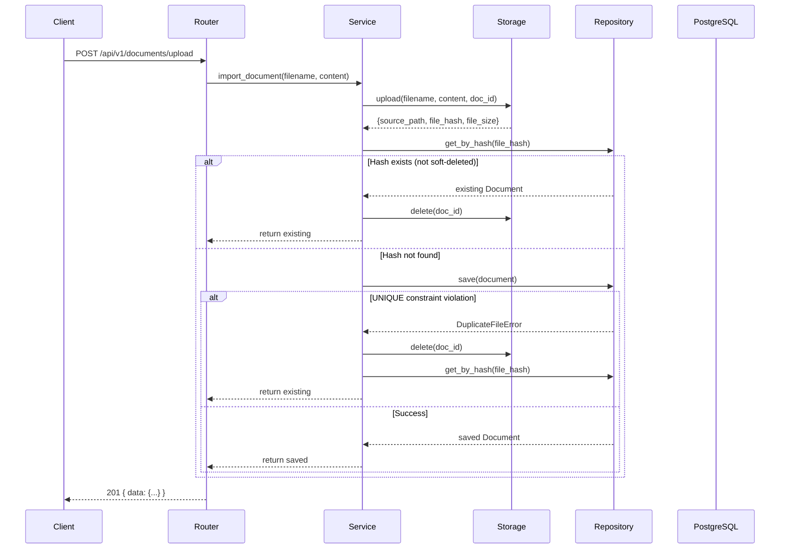

# Building LuoBlog Studio: Phase 0 and the First Feature

## Background

LuoBlog Studio is a personal AI Engineering Knowledge OS. It's not a CMS, not an AI writing tool, and not a prompt manager. It's an attempt to build a system that transforms technical documents, code, and project experience into evidence-backed blog articles — where every claim traces back to a source.

The project has a frozen PRD and a detailed ARCHITECTURE.md. Phase 0 is the foundation: repository skeleton, Docker Compose, FastAPI app factory, SQLAlchemy ORM, Alembic migrations, CI/CD, and the first vertical feature — Document Upload.

This is not a tutorial. This is an engineering log of what went right, what went wrong, and what I learned.

---

## Initial Design

The architecture follows Clean Architecture with strict dependency inversion:

```
API Layer → Service Layer → Domain Layer ← Infrastructure Layer
```

Domain depends on nothing. Services depend on domain interfaces. Infrastructure implements those interfaces. The composition root (API router) wires concrete implementations together.

For Phase 0, the plan was:

1. Create the full directory structure
2. Wire up Docker Compose with PostgreSQL 15 + PGVector
3. Build the FastAPI app factory with structured logging and middleware
4. Define domain entities with state machines
5. Implement SQLAlchemy ORM models for 14 tables
6. Set up Alembic migrations
7. Configure CI/CD (lint → typecheck → test)
8. Deliver the first feature: Document Upload API

The Document Upload flow is straightforward on paper:

```
POST /api/v1/documents/upload
  → DocumentStorage.upload()       # save to local filesystem
  → DocumentRepository.get_by_hash()  # dedup check
  → DocumentRepository.save()         # persist to PostgreSQL
  → return Document entity
```

Four layers, each independently testable. What could go wrong?

---

## Problems Encountered

### Problem 1: `pgvector` Won't Compile on Windows

The project uses `pgvector` for vector search. It requires a C extension that links against PostgreSQL client libraries. On Windows without Visual C++ Build Tools, `pip install pgvector` fails silently or hangs.

**Impact**: The entire import chain breaks. `models.py` imports `pgvector`, `repositories.py` imports `models.py`, `services/` imports `repositories.py`, and `main.py` imports the router which imports services. One missing C extension, and `uvicorn` can't even start.

**Initial reaction**: Try to fix the Windows build environment. Install Visual C++ Build Tools. Install PostgreSQL client headers. Spend hours in dependency hell.

**Better approach**: Accept the constraint. Windows is for development; Docker is for runtime. Make the codebase *resilient* to missing native dependencies.

The fix was threefold:

1. **Graceful degradation in conftest.py**: wrap the `create_app` import in a try/except that skips DB-dependent fixtures when `pgvector` is unavailable
2. **Mock-based unit tests**: Domain entities, storage logic, and service orchestration are tested without touching the database
3. **Docker-first integration tests**: Real DB tests are annotated with `@pytest.mark.skip` and run inside `docker compose`

This changed my perspective on "works on my machine." A project that crashes on import because of a missing optional dependency is fragile by design.

---

### Problem 2: Python 3.7 vs 3.11

Windows had Python 3.7 as the system default (from an old Anaconda installation). Python 3.11 was installed at `E:\python\python.exe`. The project requires 3.11+ for `StrEnum`, `asyncio` improvements, and type annotation syntax.

```
# Running `py` picked up 3.7
py scripts/full_demo.py
# SyntaxError: match/case requires 3.10+
```

**Fix**: Explicit path everywhere. Added `E:\python\python.exe` to AGENTS.md as the canonical Python. Created `.python-version` with `3.11`. Every command in documentation uses absolute paths.

This is a trivial problem with a trivial solution — but it wasted 30 minutes of debugging. The lesson: **document the development environment before writing a single line of code.**

---

### Problem 3: Clean Architecture Import Chain Violation

The `KnowledgeService` initially imported `DocumentRepository` from `infrastructure.persistence.repositories`:

```python
# BAD: Service depends on infrastructure implementation
from infrastructure.persistence.repositories import DocumentRepository
```

This violated the dependency rule: services should depend on domain abstractions, not infrastructure concretions. It also broke the import chain when `pgvector` was unavailable — the service couldn't be imported even though its logic didn't need the database.

**Fix**: Import the abstract `DocumentRepository` from `domain.repositories` instead:

```python
# GOOD: Service depends on domain interface
from domain.repositories import DocumentRepository
```

The composition root (API router) wires the concrete `DocumentRepository` into the service via dependency injection. This is textbook Clean Architecture, and it's easy to get wrong when you're moving fast.

---

### Problem 4: The Principal Engineer Review Caught Five Real Bugs

After implementing the Document Upload API and writing 32 passing tests, I ran a structured Principal Engineer review. The review checked:
- Architecture compliance
- Code quality (SOLID, duplication)
- Production readiness (logging, security, performance)

It found 2 critical, 4 major, and 3 minor issues. Let me walk through the critical ones:

#### Critical #1: Path Traversal in DocumentStorage

```python
def upload(self, *, filename, content, doc_id):
    target_dir = self._root / doc_id  # doc_id = "../../../etc/passwd" → writes outside workspace
```

The `DocumentStorage` class took `doc_id` as a string and used it directly in path construction. While the API generates UUID-based doc_ids (safe), nothing prevented a future caller from passing a malicious path.

**Fix**: Added `_validate_doc_id()` that rejects any `doc_id` containing `..`, `/`, or `\`. Applied to both `upload()` and `delete()`.

#### Critical #2: Race Condition in Deduplication

```python
# Thread A and Thread B upload the same file concurrently
storage_result = storage.upload(...)           # Both write the file
existing = await repo.get_by_hash(hash)        # Both see "no existing"
doc = await repo.save(doc)                    # Both create a record → DUPLICATE
```

The dedup check and save were not atomic. Two concurrent uploads of the same file could both pass the check and create duplicate records.

**Fix**: Added a `UNIQUE` constraint on `documents.file_hash` at the database level. The `save()` method now catches `IntegrityError` and raises a domain-level `DuplicateFileError`. The service catches this and returns the existing document.

```python
# Repository level
try:
    await self._session.flush()
except IntegrityError:
    await self._session.rollback()
    raise DuplicateFileError(document.file_hash) from None

# Service level
try:
    saved = await self._repo.save(doc)
except DuplicateFileError:
    self._storage.delete(doc_id)           # clean up the just-written file
    return await self._repo.get_by_hash(hash)  # return existing
```

---

### Problem 5: Duplicate Extension Mapping

Two files maintained independent `suffix → file type` maps:
- `local_fs.py`: `ALLOWED_EXTENSIONS` dict for validation
- `knowledge.py`: `_detect_file_type()` method for entity creation

Adding a new file type meant updating two places. Forgetting one would create an inconsistency where the storage accepted a file that the service couldn't classify.

**Fix**: Created a canonical `SUFFIX_TO_FILETYPE` mapping in `domain/enums.py` — the single source of truth. Both storage and service derive from it.

```python
# domain/enums.py — single source of truth
SUFFIX_TO_FILETYPE: dict[str, FileType] = {
    ".pdf": FileType.PDF,
    ".md": FileType.MARKDOWN,
    # ...
}

# storage validates against it
ALLOWED_EXTENSIONS: frozenset[str] = frozenset(SUFFIX_TO_FILETYPE.keys())

# service classifies with it
def _detect_file_type(filename: str) -> FileType:
    return SUFFIX_TO_FILETYPE.get(Path(filename).suffix.lower(), FileType.TXT)
```

---

## Trade-offs

### Why Clean Architecture for a Personal Project?

Clean Architecture adds boilerplate: interface definitions, dependency injection, mapper functions. For a personal project with one developer, a simple "fat model" approach (like Django's active record pattern) would require less code.

I chose Clean Architecture for three reasons:

1. **Testability**: Domain entities and services can be tested without a database. All 34 tests in this phase run in 0.4 seconds with zero infrastructure.
2. **Swappable infrastructure**: If I want to switch from local filesystem to MinIO, I change one class. If I want to switch from PostgreSQL to SQLite, I change the repository implementation. The domain and services don't change.
3. **This is a learning project**: Understanding Clean Architecture in practice — not just in blog posts — is part of the goal.

The trade-off is real: more files, more indirection. But after the Principal Engineer review caught bugs that would have been harder to find in a monolithic design, I'm convinced the structure pays for itself.

### Why PostgreSQL + PGVector Instead of LanceDB?

The PRD originally specified LanceDB (embedded, no server). I switched to PGVector for one reason: **unified data stack**.

With LanceDB + PostgreSQL, every hybrid search requires two queries (vector from LanceDB, keyword from PostgreSQL) merged in application code. With PGVector, it's one SQL query:

```sql
SELECT *, embedding <=> $1 AS vector_score
FROM document_chunks
WHERE to_tsvector('english', content) @@ plainto_tsquery($2)
ORDER BY vector_score + ts_rank(...) DESC
LIMIT 10;
```

The downside: PostgreSQL is heavier than LanceDB's embedded mode. You need Docker. For a personal project this is acceptable; for an embedded SDK it would be a dealbreaker.

---

## Final Design

After fixes, the Document Upload module looks like this:



---

## Implementation Notes

### What the code looks like

The repository pattern keeps the service clean:

```python
class KnowledgeService:
    def __init__(self, storage: DocumentStorage, doc_repo: DocumentRepository) -> None:
        self._storage = storage
        self._repo = doc_repo

    async def import_document(self, *, filename, content, ...) -> Document:
        # 1. Persist raw file
        result = self._storage.upload(filename=filename, content=content, doc_id=doc_id)
        # 2. Dedup check
        existing = await self._repo.get_by_hash(result["file_hash"])
        if existing:
            self._storage.delete(doc_id)
            return existing
        # 3. Create entity + persist
        doc = Document(...)
        try:
            return await self._repo.save(doc)
        except DuplicateFileError:
            # Race condition recovery
            self._storage.delete(doc_id)
            return await self._repo.get_by_hash(result["file_hash"])
```

The service doesn't know about HTTP, SQL, or filesystem paths. It orchestrates domain objects and delegates to abstractions.

### Test Coverage

34 tests in 0.44 seconds:

| Category | Count | Examples |
|----------|-------|----------|
| State machine | 7 | Valid transitions, invalid transitions raise errors |
| Storage (valid) | 7 | PDF, Markdown, code files, SHA-256 hashing, deletion |
| Storage (failures) | 6 | Empty file, too large, unsupported extension, path traversal |
| Edge cases | 7 | Unicode filenames, spaces, special chars, boundary sizes |
| Service (mock) | 4 | Import, dedup, not-found, pagination |
| Performance | 3 | 1MB upload <500ms, 10MB <2s, 10 concurrent writes |

---

## Lessons Learned

### 1. Structured reviews find bugs that tests miss

All 32 original tests passed. A human review found a path traversal vulnerability, a race condition, and a duplicate mapping. Tests verify behavior; reviews verify design.

### 2. Native dependencies should be optional

If a single missing C extension prevents your entire application from importing, you've coupled infrastructure too tightly to application code. Mock-friendly interfaces and graceful degradation are worth the effort.

### 3. Deduplication needs database enforcement

Application-level dedup checks (check then insert) are inherently racy. A `UNIQUE` constraint is the only reliable solution. The application code can provide a nice error message; the database provides correctness.

### 4. Extension mappings should have a single source of truth

Two files maintaining the same mapping is a bug waiting to happen. Put it in the domain layer and derive everything else from it.

### 5. Clean Architecture's value is in modification, not creation

Writing the initial code with Clean Architecture feels like overhead. The value appears when you change something — swapping storage backends, adding a new validation rule, or fixing a race condition without touching the service layer.

---

## Future Improvements

1. **Async file I/O**: `DocumentStorage.upload()` is synchronous. For large files under concurrent upload, switch to `aiofiles`.
2. **Streaming uploads**: Currently the entire file is read into memory (`await file.read()`). A 100MB upload allocates 100MB of RAM. Streaming to disk would be safer.
3. **Database integration tests in CI**: Currently skipped on Windows. Add a Dockerized PostgreSQL service to GitHub Actions for true integration coverage.
4. **Rate limiting**: The upload endpoint has no rate limit. A single user system doesn't need it now, but it's a production concern.
5. **Content type validation by magic bytes**: Currently validates by file extension only. A `.pdf` file containing plain text passes validation.

---

## Key Takeaways

- **A Principal Engineer review caught 5 issues in code that had 32 passing tests.** Tests verify behavior; reviews verify design.
- **One missing native dependency should not crash your entire import chain.** Design your modules so they degrade gracefully.
- **Deduplication is a database problem, not an application problem.** `UNIQUE` constraints are always correct; application-level checks are always racy.
- **Duplication isn't just about code — it's about knowledge.** Two files maintaining the same mapping is a bug that only manifests when someone forgets to update one of them.
- **Clean Architecture's upfront cost pays off the first time you need to change something.** The Repository pattern made fixing the race condition a one-line change in the infrastructure layer.

---

## Next Step

Phase 1 continues with the PDF Parser — the first real Document Intelligence pipeline component. This is where the system starts doing something genuinely useful: taking a research paper and transforming it into searchable, citable knowledge chunks.
