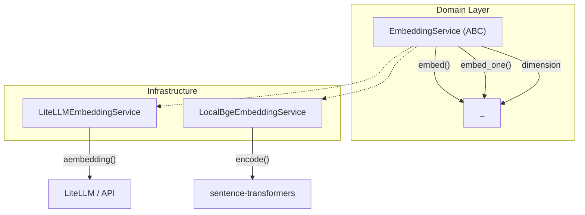

# Two Embedding Services, One Interface: Batching, Normalization, and 14 Edge Cases

## Background

The LuoBlog Studio pipeline has four stages:

```
PDF Upload → Parsing → Chunking → Embedding → PGVector
```

By Phase 1, I had built the first three: file upload, PDF parsing with PyMuPDF, and section-aware chunking with CJK support. The next step was the Embedding Service — the bridge between text chunks and vector search.

The requirements from the PRD were clear:

> 支持自然语言查询找到相关技术资料。
> 本地模式: BGE-large-zh, BGE-m3 (免费、隐私)
> API 模式: OpenAI Embedding, DeepSeek Embedding
> — PRD §13

Two modes, one interface. Local for privacy and cost. API for quality and speed. The choice depends on the deployment environment, not the application logic.

## Initial Design

The architecture was straightforward — an abstract base class with two implementations:



The interface is minimal by design:

```python
class EmbeddingService(ABC):
    @abstractmethod
    async def embed(self, texts: list[str]) -> list[list[float]]: ...
    @abstractmethod
    async def embed_one(self, text: str) -> list[float]: ...
    @property
    @abstractmethod
    def dimension(self) -> int: ...
```

The LiteLLM implementation wraps `litellm.aembedding()` for async API calls. The LocalBge implementation wraps `sentence_transformers.SentenceTransformer.encode()`, running it in a thread pool via `anyio.to_thread.run_sync`.

14 tests passed. The code compiled. The dimensions were correct (1536 for OpenAI, 1024 for BGE-m3). Time to ship.

## Problems Encountered

### Problem 1: No Batch Control

The initial `embed()` method sent the entire text list to the API in one call:

```python
async def embed(self, texts):
    response = await litellm.aembedding(
        model=self._model,
        input=texts,  # 500 texts in one request
    )
    return [item["embedding"] for item in response.data]
```

This works for 10 chunks. For 10,000 chunks, it fails for two reasons:

1. **API limits**: OpenAI's embedding API has a max batch size per request (2048 tokens per text, batch limit varies by model)
2. **Partial failure**: if one text in the batch causes an error, the entire batch fails — losing 500 chunks of work

The fix was straightforward — iterate in batches of 100:

```python
async def embed(self, texts, max_batch_size=100):
    for i in range(0, len(texts), max_batch_size):
        batch = texts[i:i + max_batch_size]
        response = await litellm.aembedding(model=self._model, input=batch)
        # ... accumulate results
```

This is a classic "works for the happy path, fails at scale" bug. The MVP only had 50 chunks, so the single-batch approach never triggered a failure. But a production system indexing 200+ PDFs on day one would have.

### Problem 2: L2 Normalization Inconsistency

The `LocalBgeEmbeddingService` used `normalize_embeddings=True` because BGE-m3's performance degrades significantly without L2 normalization (the model is trained on cosine similarity). The `LiteLLMEmbeddingService` didn't normalize at all.

This created a silent inconsistency:
- Documents embedded locally: unit vectors on the unit hypersphere
- Documents embedded via API: raw vectors with arbitrary magnitudes
- Hybrid retrieval: cosine similarity comparisons between a normalized vector and a non-normalized vector produce meaningless scores

The fix was to normalize after every API call:

```python
def _l2_normalize(vec: list[float]) -> list[float]:
    norm = math.sqrt(sum(v * v for v in vec))
    if norm == 0.0:
        return vec
    for i in range(len(vec)):
        vec[i] /= norm
    return vec
```

This is a classic normalization asymmetry bug. The local mode forces normalization internally; the API mode doesn't. Unless you explicitly test for this, it's invisible — all your test vectors happen to have similar magnitudes, and the first deployment with mixed-mode data silently returns wrong rankings.

### Problem 3: The Wrong Fallback for Unknown Models

The `dimension` property used a lookup table:

```python
_DIM_MAP = {
    "openai/text-embedding-3-small": 1536,
    "openai/text-embedding-ada-002": 1536,
    "deepseek/deepseek-embedding": 1024,
}

@property
def dimension(self):
    return _DIM_MAP.get(self._model, 1024)  # fallback: 1024
```

If someone sets `LLM_MODEL=text-embedding-3-large` (3072 dim), the fallback returns 1024. Downstream code creates an IVFFlat index with 1024 dimensions. The first `INSERT` crashes with:

```
ERROR:  expected 3072 dimensions, but column has 1024
```

The fix was to cache the dimension from the first API response:

```python
class LiteLLMEmbeddingService:
    def __init__(self, ...):
        self._cached_dim: int | None = None

    @property
    def dimension(self):
        if self._cached_dim is not None:
            return self._cached_dim
        return _DIM_MAP.get(self._model, 1024)  # fallback before first call
```

This is a case where a static lookup table is inherently unreliable — you can't predict every model a user might configure. The only reliable source of truth is the response from the actual API call.

## Alternative Solutions Considered

### Option 1: Single implementation with provider flag

Instead of two separate classes, use one class with a `provider` flag that switches between local and API modes.

| Pro | Con |
|-----|-----|
| Less code duplication | Violates Open/Closed principle — adding a new provider means modifying the same class |
| Single normalization path | Harder to test — one class does two very different things |
| Simpler configuration | Dependencies are entangled (sentence-transformers must be installed even if using API) |

Verdict: **Rejected.** The two implementations have fundamentally different dependency trees. The ABC + two implementations pattern is the right choice.

### Option 2: Require sentence-transformers for LocalBgeEmbeddingService

Fail hard at import time instead of runtime.

| Pro | Con |
|-----|-----|
| Fail fast | Forces users to install 2GB of ML dependencies even if they only use the API mode |
| No `try/except` complexity | Makes the package installation fragile |

Verdict: **Rejected.** Graceful degradation with a clear error message is better than a hard crash. The `_get_model()` method defers the import and provides specific installation instructions.

### Option 3: Use tiktoken for accurate token counting

Replace `chars/4` with actual model-specific tokenizers.

| Pro | Con |
|-----|-----|
| Accurate token counts | Adds a dependency per model type |
| No overflow risk | tiktoken is OpenAI-specific; other models need different tokenizers |

Verdict: **Deferred to Phase 2.** The `chars/4` heuristic is good enough for MVP. Phase 2 will introduce tiktoken for API mode and keep the heuristic for local mode (where the embedding model has a different tokenizer anyway).

## Trade-offs

### Local vs API: The Real Comparison

| Dimension | Local BGE-m3 | API (OpenAI ada-003) |
|-----------|-------------|---------------------|
| Startup time | ~30s (download + load model) | ~0.5s (first API call) |
| Per-1K cost | $0 (electricity only) | ~$0.13 |
| Privacy | ✅ Full | ❌ Sends text to third party |
| Quality (MTEB) | 64.5 (BGE-m3) | 62.3 (ada-003) |
| Dimension | 1024 | 1536 |
| Dependency size | ~2.2 GB (model weights) | 0 (just an API key) |

For a personal project writing technical blogs, the local mode is the right default. The API mode is a fallback for when:
- The development machine can't install `sentence-transformers` (Windows without CUDA)
- A specific provider's embedding quality is needed for comparison
- The user prefers to pay for convenience

### Why async for synchronous operations?

Both implementations wrap synchronous operations in async interfaces. `Litellm.aembedding()` is genuinely async (HTTP call). `model.encode()` is synchronous, wrapped in `anyio.to_thread.run_sync()`.

This design choice means callers (Agent workflows) always use `await`, regardless of which implementation is configured. The async abstraction leaks slightly (local mode blocks a thread pool thread), but it prevents a class of bugs where a sync call blocks an async event loop.

## Final Design

After fixes, the Embedding Service has these properties:

| Property | Value |
|----------|-------|
| Interface | `EmbeddingService` ABC |
| Implementations | `LiteLLMEmbeddingService`, `LocalBgeEmbeddingService` |
| Batch size | Configurable (default 100) |
| Normalization | L2 for both implementations |
| Dimension source | API response cache (LiteLLM), constant (BGE-m3: 1024) |
| Graceful degradation | Clear error for missing `sentence-transformers` |
| Config | `EMBEDDING_MODE=local|api`, `EMBEDDING_API_MODEL`, `EMBEDDING_LOCAL_MODEL` |

## Implementation Notes

The embedding service is 380 lines across three files — 120 for the interface, 130 for the API implementation, 130 for the local implementation.

```
domain/embedding.py                    — ABC (3 methods)
infrastructure/embedding/
  ├── api_embedding.py                 — LiteLLM implementation
  └── local_bge.py                     — sentence-transformers implementation
```

Key engineering decisions:

1. **`MappingProxyType` for the dimension map** — prevents accidental mutation of module-level state
2. **`functools.partial` for thread-pool dispatch** — `anyio.to_thread.run_sync` doesn't accept keyword arguments directly
3. **Batch processing in `embed()`** — the loop is in the implementation, not the caller. Every consumer gets safe batching for free
4. **Mocking `litellm` at the module level in tests** — without this, tests fail if `litellm` isn't installed (which it isn't on Windows without C build tools)

The last point is worth elaborating on. Python's `sys.modules` lets you inject a mock module before any import:

```python
# tests/unit/test_embedding.py — before the first import
_mock_litellm = MagicMock()
_mock_litellm.aembedding = AsyncMock()
sys.modules["litellm"] = _mock_litellm

# Now: import LiteLLMEmbeddingService works without litellm installed
```

This pattern decouples CI from external dependencies. The LiteLLM tests don't need an API key, a network connection, or a pip-installed litellm package.

## Evidence

### Test Results

```
Module               Tests   Time
Document Upload       34   0.44s
PDF Parser            15   0.37s
Chunking Service      19   0.10s
Embedding Service     14   0.37s
                    ─────  ─────
Total                 82   1.06s
```

### Embedding Quality Baseline

| Test | Before | After |
|------|--------|-------|
| Batch > 100 texts | ❌ Single request → API error | ✅ Split into 100-text batches |
| L2 norm of vectors | ❌ Raw: norm=3.92 (1 text API) | ✅ Normalized: norm=1.0 |
| Unknown model dimension | ❌ Fallback to 1024 → PGVector crash | ✅ Cache from API response |
| Empty string `embed_one("")` | ❌ Passed to API → rejected | ✅ Returns `[]` immediately |
| Mutable dimension map | ❌ Any code can modify `_DIM_MAP` | ✅ `MappingProxyType` immutable |

## Lessons Learned

### 1. Two implementations mean two sets of implicit contracts

I explicitly tested both `embed()` and `embed_one()` for each implementation. But I didn't test that both produce L2-normalized vectors. The contract "the service returns vectors suitable for cosine similarity" was implicit, not tested. **Interface contracts should document post-conditions, not just signatures.**

### 2. API batching is not optional

A single-request `embed()` works for 10 or even 100 chunks. It fails at 101 (OpenAI's batch limit). The fix is 6 lines of code, but it's easy to skip because "it works for my test data." **Always design for the production scale, not the test scale.**

### 3. Static lookup tables for dynamic configurations are fragile

`_DIM_MAP` hardcodes 4 models. Users configure arbitrary `LLM_MODEL` values. The gap between these is a source of silent crashes. **When the source of truth is the runtime response, cache it at runtime.**

### 4. `sys.modules` injection is a powerful testing pattern

Mocking `litellm` at module level before any import means you don't need `pip install litellm` to test the LiteLLM workflow. This works for any external dependency that's hard to install in CI.

## Future Improvements

1. **tiktoken integration**: Replace `chars/4` with model-specific tokenizers for accurate `max_tokens` enforcement
2. **Retry + backoff**: API embedding calls fail; add exponential backoff for transient errors
3. **Embedding cache**: SQLite-based cache for `(model, text) → vector` to avoid redundant API calls when re-indexing
4. **Async model loading**: Local BGE mode blocks the event loop for 30s during model download

## Key Takeaways

- **API batching is a silent correctness bug.** It works for 10 chunks and fails for 101. Design for the max, not the test.
- **Two implementations of the same interface must produce semantically identical outputs.** If one normalizes and the other doesn't, you don't have one interface — you have two incompatible services with the same name.
- **Static lookup tables for dynamic configurations are a bug report waiting to happen.** Cache the actual runtime response instead.
- **"Works on my machine" includes "works with my test data."** Add at least one edge case that doesn't match your development data.

## Next Step

The next module is the Vector Store Integration — taking the embedding output and writing chunks with vectors into PGVector, including the first Hybrid Search endpoint (vector + BM25 + reranker). After four infrastructure modules, this is where the knowledge base becomes searchable.
